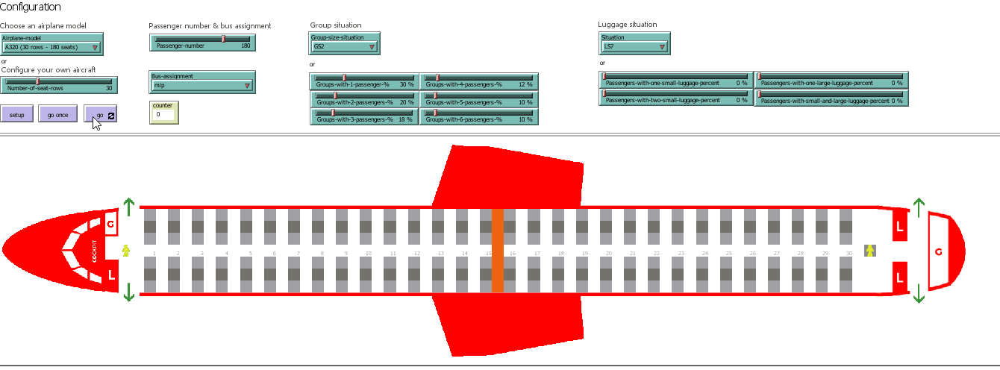
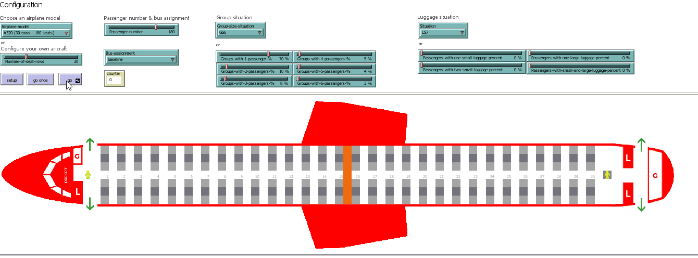
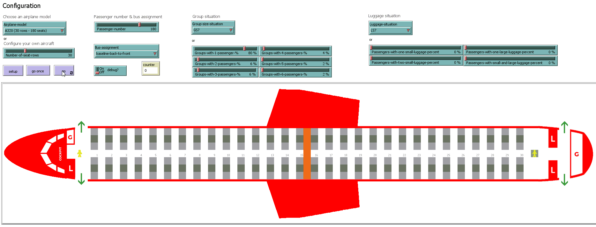

Please feel free to contact us at liviu.cotfas at ase .ro for the NetLogo source code. 

# Scenarios

All the simulations have been performed using the following settings:
- occupancy level: 100% (180 passengers);
- luggage situation: S7 (described in our paper).

> Suggestion: You can download the animations below in order to watch them at a higher resolution.

## Group Scenario 1: 
### MIP-GS1

### Baseline-GS1

## Group Scenario 2: 
## MIP-GS2

### Baseline-GS2

## Group Scenario 3: 
**MIP-GS3**

## Baseline-GS3

## Baseline-GS4

## Baseline-GS5

## Baseline-GS6

## Baseline-GS7

## MIP-GS4

## MIP-GS5

## MIP-GS6

## MIP-GS7
